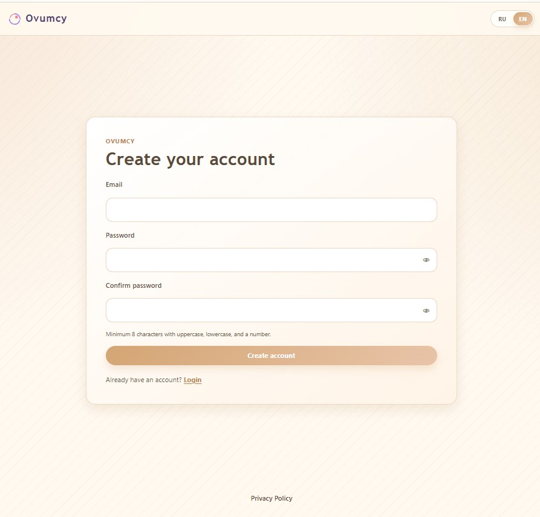
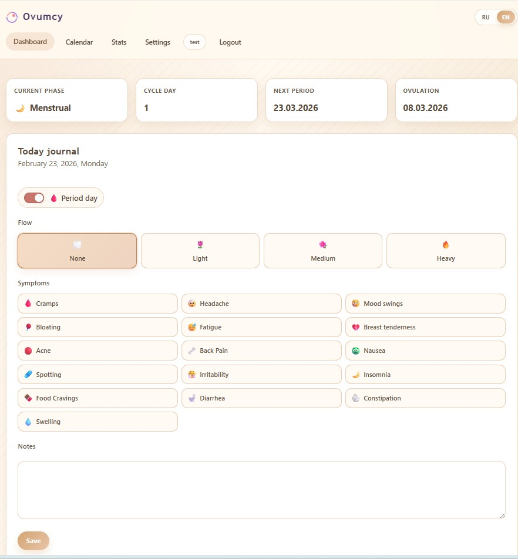
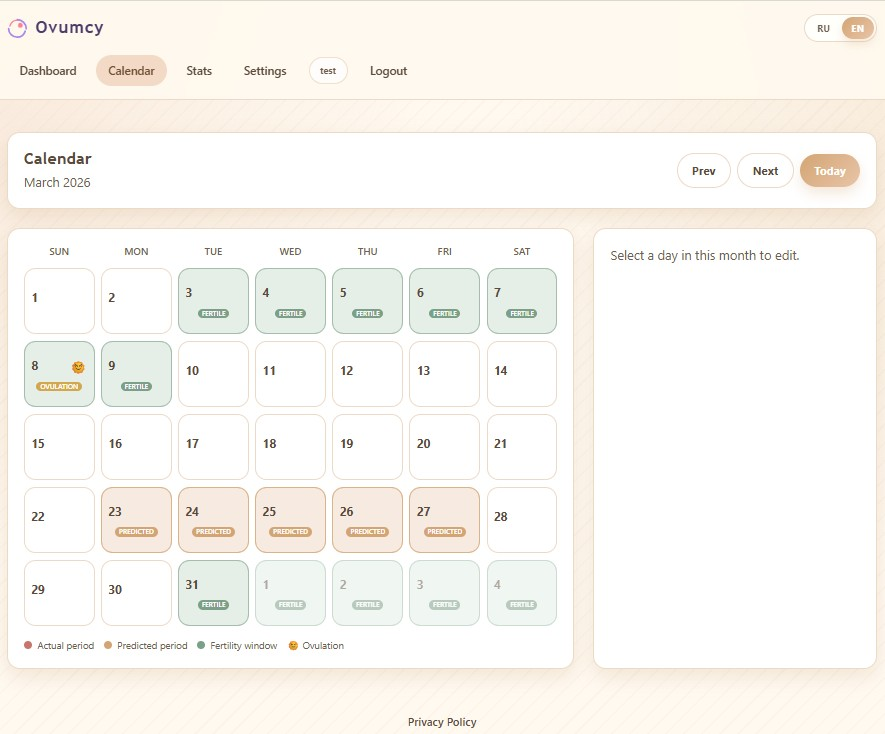

# Ovumcy

[](https://github.com/terraincognita07/ovumcy/actions/workflows/ci.yml)
[](https://www.gnu.org/licenses/agpl-3.0)
[](https://go.dev/)
[](https://www.docker.com/)

Ovumcy is a privacy-first, self-hosted menstrual cycle tracker.
It runs as a single Go service with SQLite and a server-rendered web UI.

## Screenshots

### Registration



### Dashboard



### Calendar



## Features

- Cycle tracking: period days, flow intensity, symptoms, notes.
- Predictions: next period, ovulation, fertile window.
- Calendar and statistics views.
- Single-user owner workflow (self-hosted private tracking).
- Data export in CSV and JSON.
- Russian and English localization.

## Privacy and Security

- No analytics or ad trackers.
- No third-party API dependencies for core functionality.
- First-party cookies only (auth, CSRF, language).
- Data is stored locally in SQLite on your infrastructure.
- Role model: `owner` has full access.

If you found a security issue, see [SECURITY.md](SECURITY.md).

## Tech Stack

- Backend: Go, Fiber, GORM, SQLite.
- Frontend: server-rendered HTML templates, HTMX, Alpine.js, Tailwind CSS.
- Deployment: Docker or direct binary execution.

## Quick Start

### Docker

Uses the prebuilt image from GHCR by default (`ghcr.io/terraincognita07/ovumcy:latest`).

```bash
git clone https://github.com/terraincognita07/ovumcy.git
cd ovumcy
cp .env.example .env
# edit SECRET_KEY in .env
docker compose -f docker/docker-compose.yml pull
docker compose -f docker/docker-compose.yml up -d
```

Pin a specific image tag if needed:

```bash
OVUMCY_IMAGE=ghcr.io/terraincognita07/ovumcy:v0.1.0 docker compose -f docker/docker-compose.yml up -d
```

Then open `http://localhost:8080`.

### Manual

Requirements:

- Go 1.24+
- Node.js 18+

```bash
git clone https://github.com/terraincognita07/ovumcy.git
cd ovumcy
npm ci
npm run build
go run ./cmd/ovumcy
```

## Configuration

Primary variables:

```env
# Core
TZ=UTC
DEFAULT_LANGUAGE=ru
SECRET_KEY=replace_with_at_least_32_random_characters
DB_PATH=data/ovumcy.db
PORT=8080
COOKIE_SECURE=false

# Rate limits
RATE_LIMIT_LOGIN_MAX=8
RATE_LIMIT_LOGIN_WINDOW=15m
RATE_LIMIT_FORGOT_PASSWORD_MAX=8
RATE_LIMIT_FORGOT_PASSWORD_WINDOW=1h
RATE_LIMIT_API_MAX=300
RATE_LIMIT_API_WINDOW=1m

# Reverse proxy trust
TRUST_PROXY_ENABLED=false
PROXY_HEADER=X-Forwarded-For
TRUSTED_PROXIES=127.0.0.1,::1
```

Operational notes:

- Always set a strong `SECRET_KEY`.
- Set `COOKIE_SECURE=true` when serving over HTTPS.
- Enable `TRUST_PROXY_ENABLED` only when running behind a trusted reverse proxy.

## Database and Migrations

- Initial schema is in `migrations/001_init.sql`.
- For post-release schema changes, add forward-only numbered migrations (`002_*.sql`, `003_*.sql`, ...).
- Do not edit already-applied migration files after release.

## Development

Common commands from the repository root:

```bash
go test ./...
npm run build
go run ./cmd/ovumcy
```

CI runs staticcheck, `go vet`, tests, and frontend build on pushes and pull requests.

## Contributing

See [CONTRIBUTING.md](CONTRIBUTING.md).

For bugs and feature requests, open a GitHub issue:
- https://github.com/terraincognita07/ovumcy/issues

## Releases

- Initial release target: `v0.1.0`.
- Publish release notes via GitHub Releases and keep [CHANGELOG.md](CHANGELOG.md) updated.

## Roadmap

### In Progress

- Mobile PWA: manifest, offline mode, install prompt.

### v0.2 - Self-hosting quality

- Custom symptoms: add and hide symptoms beyond built-in defaults.
- Import from other trackers: Clue, Flo CSV import.
- Reverse proxy examples: Nginx and Caddy configuration samples.
- Web Push notifications: period predictions delivered via browser push, no third-party services.
- Dark mode.

### v0.3 - Depth

- PDF export for clinical use: printable cycle summary for medical appointments.
- Extended statistics: cycle variability, symptom heatmaps, phase correlations.
- Partner invite via link: simplified partner onboarding without manual account setup.

### Considering

- Managed hosting option.
- Optional end-to-end encrypted sync (client-side key, self-hosted or managed).

## License

Ovumcy is licensed under AGPL v3.
See [LICENSE](LICENSE).
